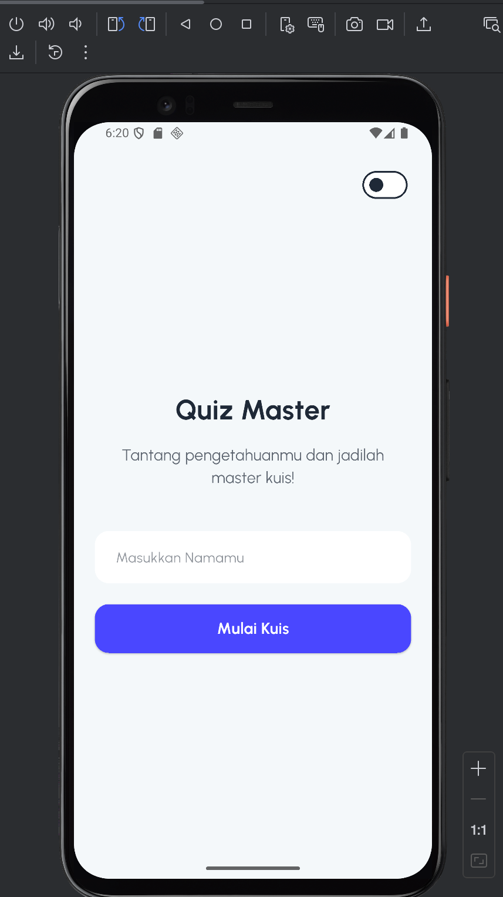
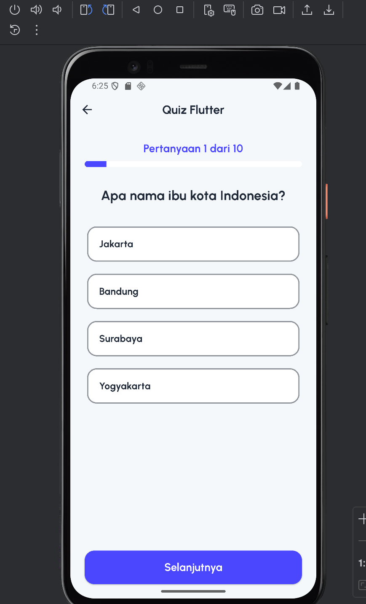
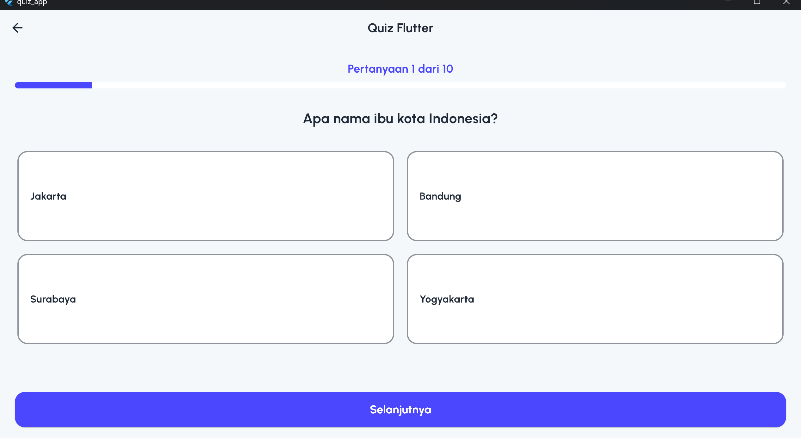
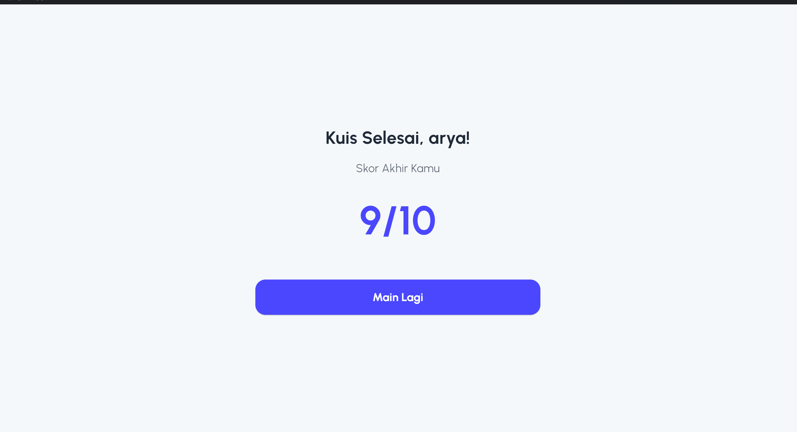
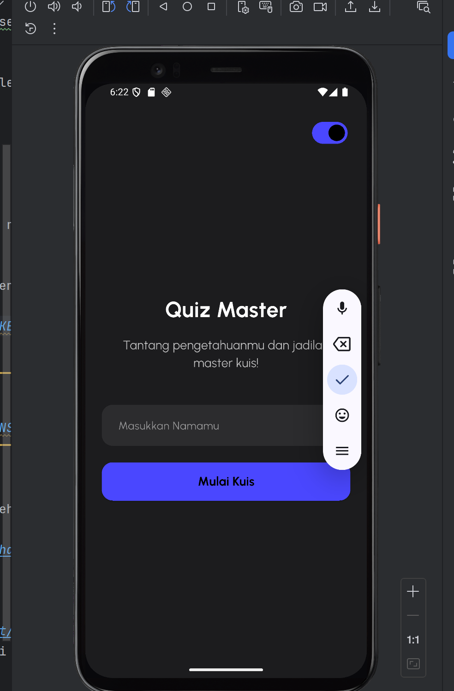
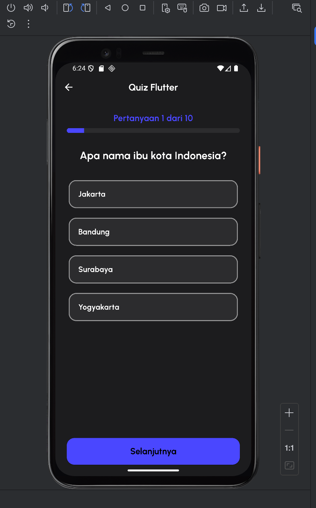

# Quiz Master - Aplikasi Kuis Berbasis Flutter

## Identitas

* **Nama:** Muhammad Aryasatya
* **NIM:** 231401094
* **Lab:** 2

## Deskripsi Aplikasi

Aplikasi ini adalah kuis pilihan ganda yang dibuat menggunakan Flutter sebagai pemenuhan tugas. Aplikasi ini menerapkan semua kriteria wajib dan opsional, termasuk:
* State Management (Provider) untuk menjaga progres saat rotasi.
* Dual-Theme (Light & Dark Mode) yang bisa di-toggle.
* Desain Adaptif & Responsif (tampilan 1 kolom di HP dan 2 kolom di tablet).
* Navigasi antar halaman dengan data passing.
* Widget terpisah (reusable) dan struktur folder yang rapi.
* Riwayat commit semantik.

## Screenshot/Video Aplikasi

*(Catatan: Anda harus mengambil screenshot, menambahkannya ke folder di repository ini (misal: buat folder `screenshots/`), lalu ganti `LINK_KE_SCREENSHOT_ANDA` di bawah dengan path yang benar, contoh: `screenshots/welcome_light.png`)*

**Light Mode**
| Welcome Screen | Quiz Screen (HP) | Quiz Screen (Tablet) | Score Screen |
| :---: | :---: | :---: | :---: |
|  |  |  |  |

**Dark Mode**
| Welcome Screen | Quiz Screen (HP) |
| :---: | :---: |
|  |  |

## Link Mockup/Prototype Aplikasi

Desain dan inspirasi visual aplikasi ini didasarkan pada *case study* Behance berikut :

* **Link:** [Quiz Master AI-Powered Quiz App Case Study](https://www.behance.net/gallery/230564500/Quiz-Master-AI-Powered-Quiz-App-Case-Study)

## Credit ke Sumber-sumber Aset

* **Desain:** [Quiz Master AI by Ravindra Kumar](https://www.behance.net/gallery/230564500/Quiz-Master-AI-Powered-Quiz-App-Case-Study) (di Behance)
* **Font:** [Urbanist](https://fonts.google.com/specimen/Urbanist) (dari Google Fonts)